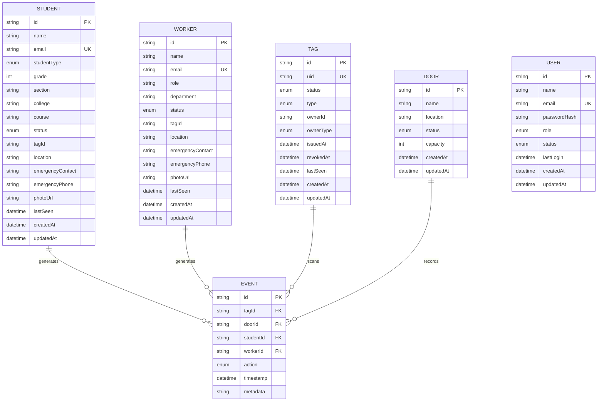
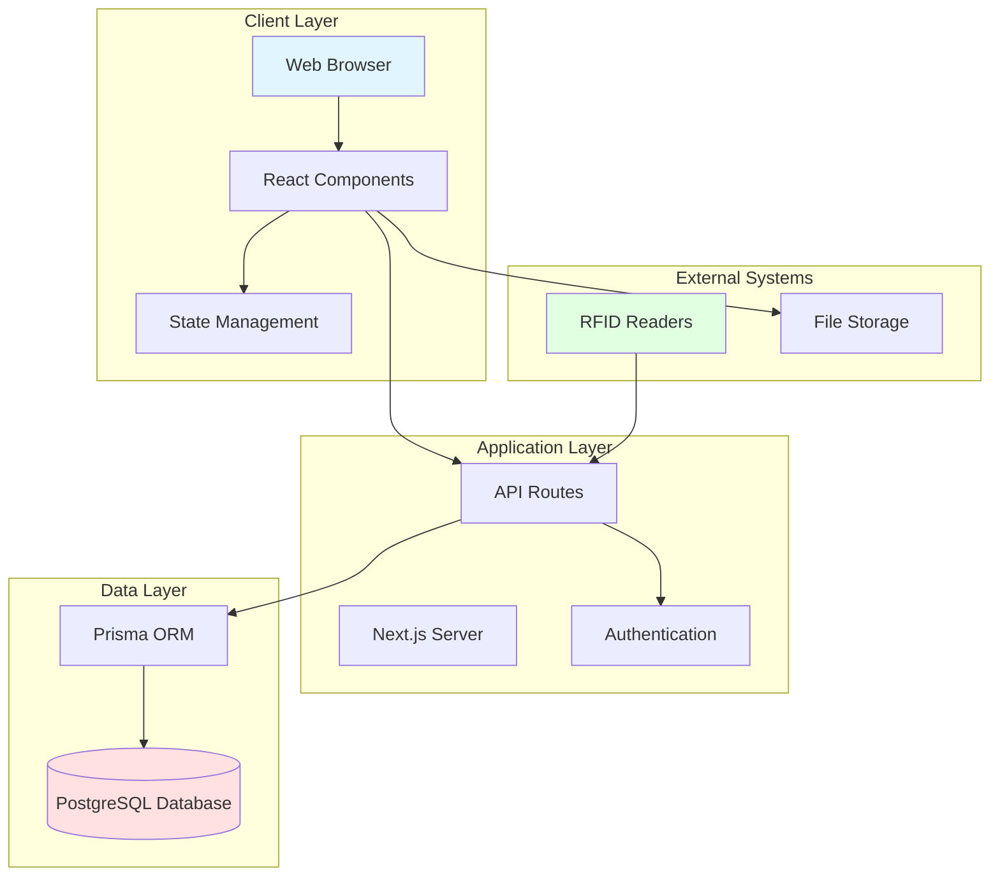
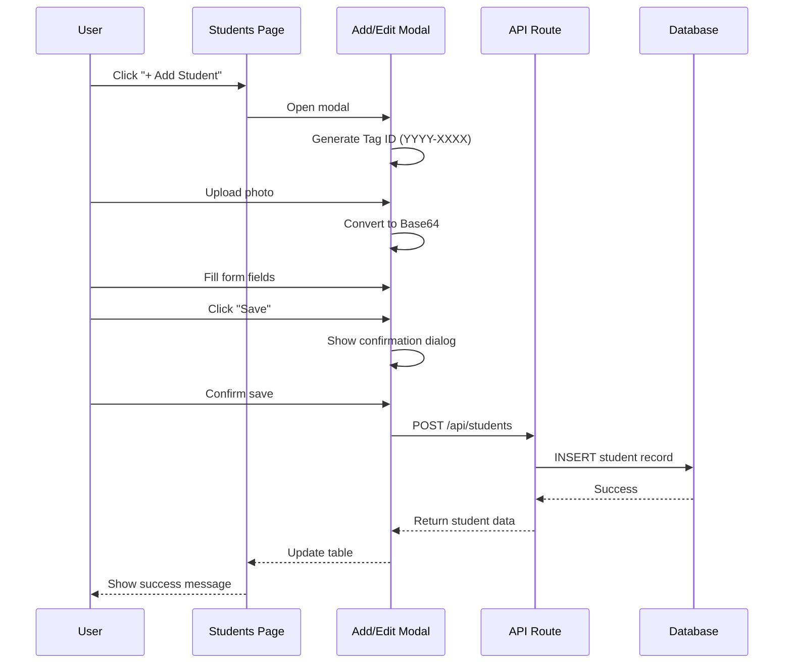
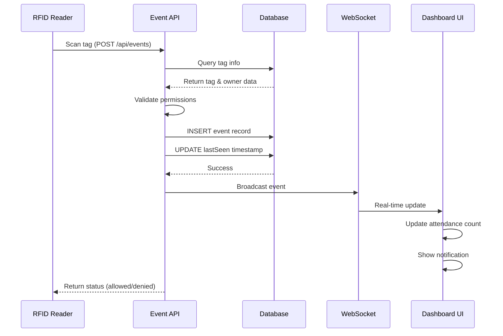
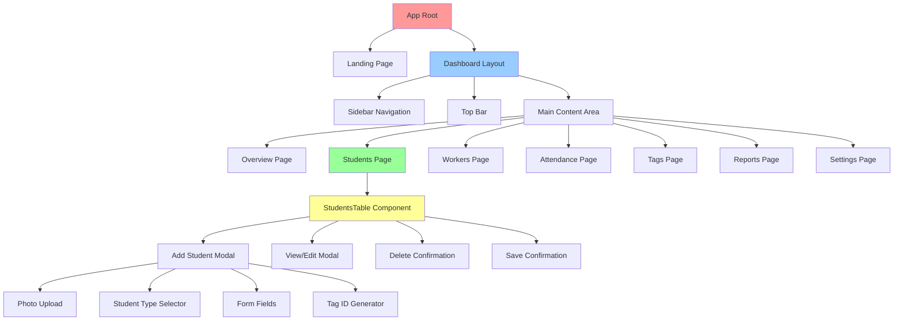
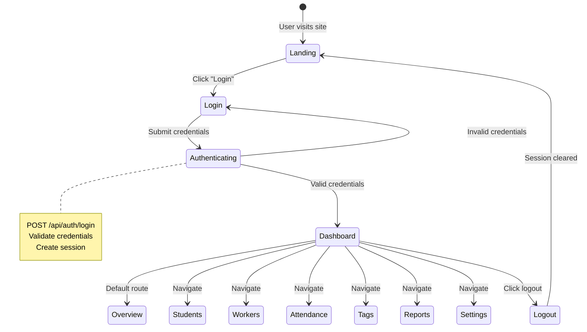
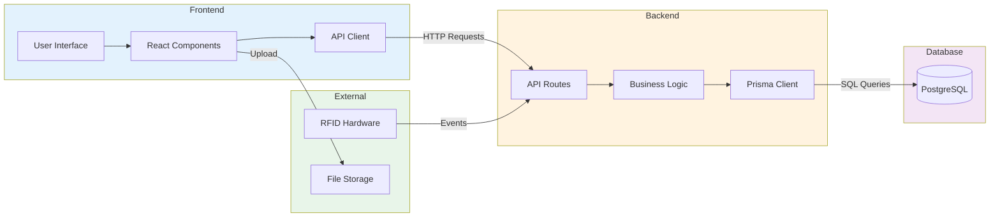

# System Diagrams

## 1. Database Entity Relationship Diagram (Mermaid)

## 2. System Architecture Diagram (Mermaid)

## 3. Student Management Flow (Mermaid)

## 4. RFID Event Flow (Mermaid)

## 5. Component Hierarchy (Mermaid)

## 6. Authentication Flow (Mermaid)

## 7. Data Flow Architecture (Mermaid)

---

## How to Use These Diagrams

### Option 1: Mermaid Live Editor
1. Go to https://mermaid.live/
2. Copy any diagram code above
3. Paste into the editor
4. Download as PNG/SVG

### Option 2: VS Code Extension
1. Install "Markdown Preview Mermaid Support" extension
2. Open this file in VS Code
3. Use Markdown preview
4. Right-click diagram → Export as image

### Option 3: GitHub/GitLab
- These platforms render Mermaid diagrams automatically in markdown files

### Option 4: Draw.io / Lucidchart
- Use the text descriptions to manually create diagrams
- More customization options available

### Option 5: PlantUML
- Convert Mermaid syntax to PlantUML
- Generate high-quality diagrams

---

## Additional Diagram Tools

**For ERD:**
- dbdiagram.io - Paste schema, get visual ERD
- QuickDBD - Quick database diagram tool

**For Flowcharts:**
- draw.io (diagrams.net) - Free, powerful
- Lucidchart - Professional diagrams
- Figma - Design tool with diagramming

**For Architecture:**
- Excalidraw - Hand-drawn style diagrams
- Cloudcraft - AWS architecture diagrams
- Structurizr - C4 model diagrams

---

## Quick Reference: Diagram Types

| Diagram Type | Best Tool | Use Case |
|--------------|-----------|----------|
| ERD | Mermaid, dbdiagram.io | Database structure |
| Sequence | Mermaid, PlantUML | API flows, interactions |
| Flowchart | Mermaid, draw.io | Process flows |
| Component | Mermaid, draw.io | UI hierarchy |
| State | Mermaid, PlantUML | User journeys |
| Architecture | draw.io, Lucidchart | System overview |

